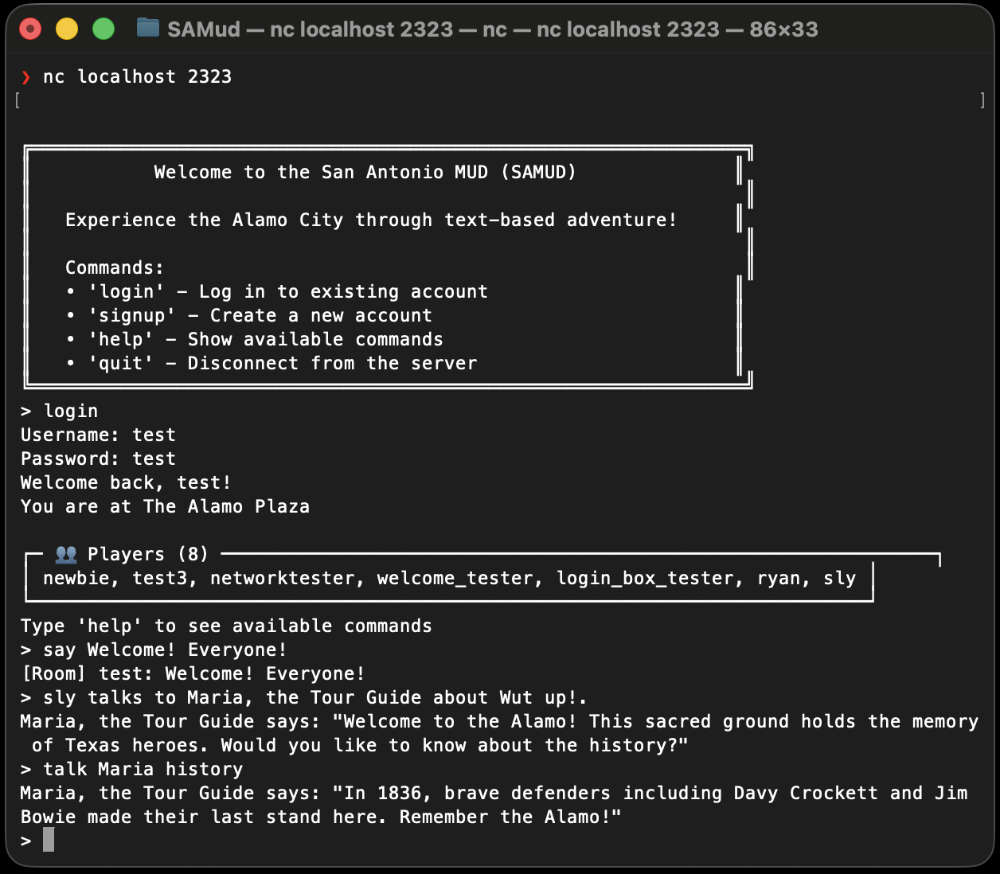

# San Antonio MUD (SAMud) 🤠



A text-based multiuser dungeon (MUD) game set in the vibrant city of San Antonio, Texas. Explore iconic landmarks, interact with NPCs, collect items, and chat with other players in this nostalgic multiplayer adventure.

## 🌟 Features

### 🗺️ **Immersive San Antonio World**
- **7 Themed Locations**: Explore The Alamo Plaza, River Walk, The Pearl, Mission San José, Southtown, and Tower of the Americas
- **Rich Descriptions**: Each location features detailed, atmospheric descriptions of real San Antonio landmarks

### 👥 **Multiplayer Experience**
- **Real-time Chat**: Room-based (`say`) and global (`shout`) communication
- **Live Interactions**: See other players' actions as they happen
- **Session Persistence**: Your progress and location are automatically saved

### 🎭 **NPCs & Storytelling**
- **5 Unique Characters**: Meet Maria the Tour Guide, Carlos the Mariachi, Chef Isabella, Father Miguel, and Diego the Muralist
- **Keyword-based Conversations**: Talk to NPCs about specific topics (history, food, music, art, etc.)
- **Cultural Immersion**: Learn about San Antonio's rich Mexican-American heritage

### 🎒 **Item System**
- **Collectible Items**: Find themed items in each location (historic brochure, guitar pick, churros, recipe card, etc.)
- **Inventory Management**: Pick up, drop, and manage your items
- **Smart Matching**: Use partial names for commands (e.g., `get guitar` instead of full item name)

### 🛡️ **User Management**
- **Secure Authentication**: Account creation and login with encrypted passwords
- **Welcome Guide**: New players receive comprehensive command tutorials
- **Help System**: Context-aware help and usage instructions

## 🚀 Quick Start

### Prerequisites
- Python 3.6 or higher
- Network access (for multiplayer)

### Installation & Setup

1. **Clone or download the project files**:
   ```bash
   git clone <repository-url>
   cd SAMud
   ```

2. **Start the server**:
   ```bash
   python3 server.py
   ```

3. **Connect to the game**:
   ```bash
   # Local connection
   nc localhost 2323

   # Or if you have telnet
   telnet localhost 2323
   ```

### For Friends to Join

When you start the server, it will display connection information:
```
🌐 Server accessible at:
   Local:    nc localhost 2323
   Network:  nc YOUR_IP_ADDRESS 2323
```

Share your IP address with friends so they can connect from other devices on the same network.

## 🎮 How to Play

### First Time Setup

1. **Create an Account**:
   ```
   > signup
   Choose a username: myname
   Choose a password: mypass
   ```

2. **Follow the Welcome Guide**: New players receive a comprehensive tutorial with all essential commands.

### Essential Commands

#### 🔍 **Exploration**
- `look` - Examine your surroundings, see exits, players, NPCs, and items
- `north`, `south`, `east`, `west` (or `n`, `s`, `e`, `w`) - Move between rooms
- `where` - Check your current location

#### 🎒 **Items**
- `get <item>` - Pick up items (e.g., `get brochure`, `get guitar`)
- `drop <item>` - Drop items from your inventory
- `inventory` (or `inv`, `i`) - View what you're carrying

#### 🗣️ **NPCs**
- `talk <npc>` - Start a conversation (e.g., `talk maria`)
- `talk <npc> <keyword>` - Ask about specific topics (e.g., `talk carlos music`)

#### 💬 **Communication**
- `say <message>` - Talk to players in the same room
- `shout <message>` - Send a message to all players worldwide
- `who` - See who's currently online

#### ⚙️ **System**
- `help` - Display all available commands
- `quit` - Save your progress and exit

### Pro Tips

- **Partial matching works**: You can use `get guitar` instead of typing the full item name
- **Try keywords with NPCs**: Ask about "history", "food", "music", "art", "culture"
- **Explore thoroughly**: Each location has unique items and NPCs to discover
- **Use room chat**: `say` commands are great for coordinating with nearby players

## 🏗️ Technical Details

### Architecture

- **Server**: Python 3 with socket programming for telnet compatibility
- **Database**: SQLite for user accounts, world state, and item persistence
- **Networking**: Multi-threaded server supporting concurrent connections
- **Security**: PBKDF2 password hashing with salt

### File Structure

```
SAMud/
├── server.py          # Main server application
├── database.py        # Database models and operations
├── samud.db          # SQLite database (auto-created)
├── CLAUDE.md         # Development documentation
└── README.md         # This file
```

### Database Schema

- **Users**: Authentication, current location, login history
- **Rooms**: World geography, descriptions, exits
- **NPCs**: Characters, locations, dialogue responses
- **Items**: Collectibles, descriptions, current locations

## 🎯 Gameplay Features

### The San Antonio World

1. **The Alamo Plaza** - Historic courtyard with Maria the Tour Guide
2. **River Walk North** - Scenic waterway with Carlos the Mariachi
3. **River Walk South** - Peaceful cypress-lined waters
4. **The Pearl** - Vibrant food district with Chef Isabella
5. **Tower of the Americas** - Iconic 750-foot observation tower
6. **Mission San José** - "Queen of Missions" with Father Miguel
7. **Southtown** - Artistic neighborhood with Diego the Muralist

### NPCs and Their Specialties

- **Maria** (Alamo Plaza): Texas history, Alamo battle, heroes
- **Carlos** (River Walk North): Music, guitar, Mexican culture, serenades
- **Chef Isabella** (The Pearl): Food, cooking, puffy tacos, local ingredients
- **Father Miguel** (Mission San José): Spirituality, mission history, Rose Window
- **Diego** (Southtown): Art, murals, culture, neighborhood gentrification

### Collectible Items

- **Historic Brochure** (Alamo Plaza): Learn about Texas heroes
- **Guitar Pick** (River Walk North): Tortoiseshell memento from mariachi
- **Fresh Churros** (River Walk South): Sweet street vendor treats
- **Recipe Card** (The Pearl): Abuela's secret puffy taco recipe
- **Mission Bell** (Mission San José): Brass replica of historic bells
- **Paint Brush** (Southtown): Artist's tool with vibrant paint colors
- **Vintage Postcard** (Tower of Americas): 1968 World's Fair memorabilia

## 🛠️ Development

### Commands Implementation

The game features a robust command parsing system with:
- **Flexible input**: Partial matching for items and NPCs
- **Context-aware help**: Different help messages based on authentication state
- **Error handling**: Helpful error messages with suggestions
- **Real-time updates**: Immediate feedback for all actions

### Multiplayer Features

- **Session management**: Each player has a persistent session with authentication state
- **Real-time broadcasting**: Actions are immediately visible to other players
- **Room-based interactions**: Players can interact when in the same location
- **Global communication**: Server-wide messaging system

## 🤝 Contributing

This project was created as a learning exercise in MUD development. Feel free to:
- Add new rooms and expand the San Antonio world
- Create additional NPCs with rich dialogue systems
- Implement new item types and interactions
- Enhance the multiplayer experience

## 📜 License

This project is licensed under the MIT License - see the [LICENSE](LICENSE) file for details.

## 🙏 Acknowledgments

- Inspired by classic MUD games of the 1980s and 1990s
- Built with love for San Antonio's rich culture and history
- Created using Claude Code for rapid development and iteration

---

**¡Bienvenidos to the San Antonio MUD! Ready to explore the Alamo City?** 🌵